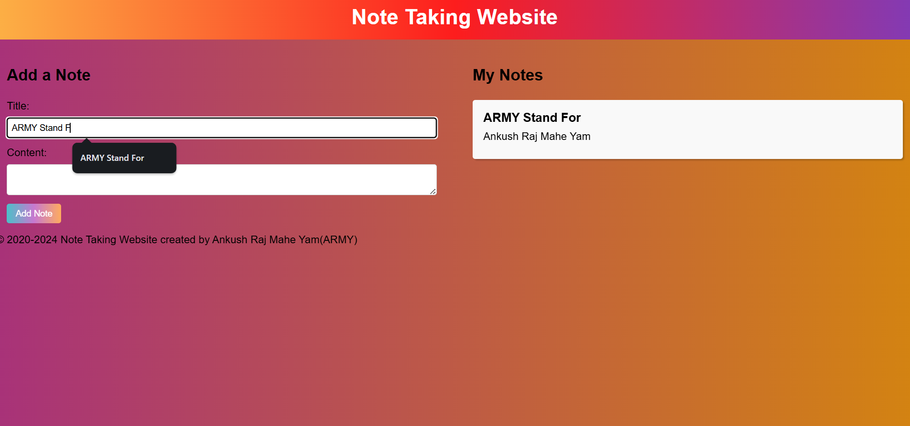

# Note-Taking-Website

Welcome to the Note-Taking-Website project! This project aims to provide a simple and intuitive note-taking experience using HTML, CSS, and JavaScript.

## Features
- Create notes.
- Save notes locally in the browser's storage.
- Clean and responsive design.

## Usage
To use the Note-Taking-Website, simply open the `index.html` file in your web browser. From there, you can start creating and managing your notes.

## About Me  

Hi, I’m **Ankush Raj Mahe Yam (ARMY)**, an aspiring software developer. I’m passionate about coding and enjoy sharing my learning journey to help others grow.  

🌟 Connect with me:  
- **Google Search:** [Ankush Raj Mahe Yam](https://www.google.com/search?q=ankush+raj+mahe+yam)  
- **LinkedIn:** [Ankush Raj Mahe Yam](https://linkedin.com/in/ankushrajmaheyam)  
- **GitHub:** [Ankush Raj Mahe Yam](https://github.com/AnkushRajMaheYam)  
- **Instagram:** [@AnkushRajaMaheYam](https://instagram.com/AnkushRajaMaheYam)  
- **Facebook:** [Ankush Raj Mahe Yam](https://facebook.com/AnkushRajMaheYam)  

---

## License
All rights reserved by Ankush Raj Mahe Yam (ARMY).
